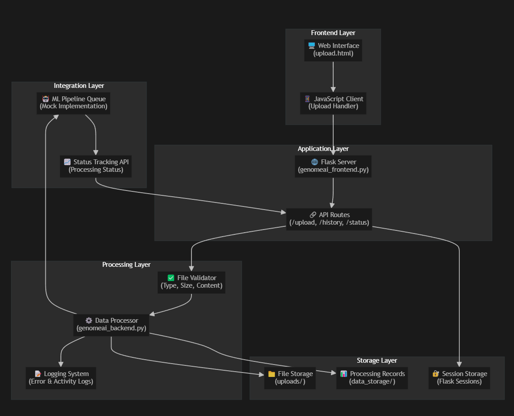

# GenomeAI Data Module - Technical Documentation 


## Table of Contents

1. [Executive Summary](#executive-summary)
2. [System Architecture Overview](#system-architecture-overview)
3. [Component Architecture](#component-architecture)
4. [Data Flow Architecture](#data-flow-architecture)
5. [API Specification](#api-specification)
6. [File Processing Pipeline](#file-processing-pipeline)
7. [Security Architecture](#security-architecture)
8. [Supported File Formats](#supported-file-formats)
9. [Implementation Details](#implementation-details)
10. [Deployment Guide](#deployment-guide)
11. [Performance & Scalability](#performance--scalability)
12. [Future Enhancements](#future-enhancements)
13. [Appendices](#appendices)

---

## Executive Summary

The GenomeAI Data Module is a comprehensive file upload system designed specifically for genomic data processing and machine learning pipeline integration. The system provides a secure, user-friendly interface for uploading various genomic file formats with robust validation, error handling, and progress tracking capabilities.

### Key Features Delivered

- **Modern Web Interface** with drag-and-drop functionality
- **Comprehensive File Validation** supporting 11+ genomic formats
- **Real-time Progress Tracking** with visual feedback
- **Robust Error Handling** with detailed logging
- **Scalable Architecture** ready for production deployment
- **Security-First Design** with multi-layer validation
- **ML Pipeline Integration** hooks for automated processing

### Technical Specifications

- **Maximum File Size:** 5 GB per upload
- **Supported Formats:** CSV, TSV, XLSX, VCF, FASTA, FASTQ, BED, GFF, GTF, SAM, BAM
- **Framework:** Flask (Python 3.8+)
- **Frontend:** Modern HTML5/CSS3/JavaScript
- **Architecture:** Layered, modular design
- **Deployment:** Docker-ready, cloud-compatible

---

## System Architecture Overview

### High-Level Architecture Diagram



### Architecture Principles

1. **Separation of Concerns:** Clear layer separation for maintainability
2. **Scalability:** Designed for horizontal and vertical scaling
3. **Security:** Multi-layer validation and sanitization
4. **Modularity:** Independent, reusable components
5. **Extensibility:** Plugin architecture for new file formats
6. **Reliability:** Comprehensive error handling and logging

---

## Component Architecture

### 1. Frontend Layer

#### Web Interface (`templates/upload.html`)
- **Technology:** HTML5, CSS3, Vanilla JavaScript
- **Features:**
  - Responsive design for desktop and mobile
  - Drag-and-drop file upload interface
  - Real-time progress tracking
  - File validation feedback
  - Upload history display
  - Modern gradient UI design

#### JavaScript Client
```javascript
class GenomeAIUploader {
    // Handles file selection, validation, upload, and progress tracking
    - setupEventListeners()
    - validateFile(file)
    - uploadFile(file)
    - updateProgress(percentage)
    - loadUploadHistory()
}
```

### 2. Application Layer

#### Flask Web Server (`genomeai_frontend.py`)
```python
# Core Flask application with the following endpoints:
- GET  /                    # Upload interface
- POST /upload              # File upload handler
- GET  /upload_history      # User upload history
- GET  /upload_status/<id>  # Processing status
- GET  /supported_formats   # Supported file formats
```

#### Key Components:
- **Session Management:** User isolation and state tracking
- **Error Handling:** HTTP status codes and JSON responses
- **Logging System:** Structured logging for monitoring
- **Configuration Management:** Environment-based settings

### 3. Processing Layer

#### File Validator
```python
def validate_file_format(file_path: str) -> Tuple[bool, str, Optional[str]]:
    """
    Multi-level validation:
    1. File existence and accessibility
    2. File size limits (≤5GB)
    3. Extension whitelist checking
    4. MIME type verification
    5. Format-specific content validation
    """
```

#### Data Processor (`genomeai_backend.py`)
```python
class GenomeAIDataProcessor:
    """
    Core processing engine with capabilities:
    - File format detection and validation
    - Content integrity checking
    - Metadata extraction and storage
    - ML pipeline integration
    - Processing status tracking
    """
```

### 4. Storage Layer

#### File System Structure
```
GenomeAI_data_module/
├── uploads/                    # Uploaded files
│   └── {user}_{timestamp}_{filename}
├── data_storage/              # Processing metadata
│   └── processing_records/    # JSON processing records
├── templates/                 # HTML templates
├── logs/                     # Application logs
├── static/                   # CSS/JS assets
└── requirements.txt          # Python dependencies
```

#### Processing Record Schema
```json
{
  "user_id": "string",
  "original_filename": "string",
  "file_path": "string",
  "file_hash": "sha256_hash",
  "file_format": "detected_format",
  "file_size": "bytes",
  "upload_timestamp": "ISO_8601",
  "processing_status": "queued|processing|completed|failed",
  "metadata": {
    "validation_results": {},
    "processing_notes": []
  }
}
```

---

## Data Flow Architecture

### Upload Process Flow

```
1. 📤 User Action
   ├── File selection via dialog or drag-and-drop
   └── Client-side validation (size, extension)

2. 🔍 Frontend Processing
   ├── File object creation
   ├── Progress bar initialization
   └── AJAX upload preparation

3. 📡 Network Transfer
   ├── XMLHttpRequest with progress tracking
   ├── Multipart form data encoding
   └── Real-time progress updates

4. ✅ Server-side Validation
   ├── Request validation
   ├── File type checking
   ├── Size limit enforcement
   └── Content format validation

5. 💾 Secure Storage
   ├── Filename sanitization
   ├── File system storage
   └── Metadata record creation

6. 🤖 ML Pipeline Integration
   ├── Processing queue addition
   ├── Status tracking initialization
   └── User notification

7. 📈 Response & Feedback
   ├── JSON response generation
   ├── Frontend status update
   └── Upload history refresh
```

### Error Handling Flow

```
Error Detection → Classification → Logging → User Feedback → Recovery

1. Error Detection Points:
   - Client-side validation
   - Network transfer issues
   - Server-side validation
   - File processing errors
   - Storage failures

2. Error Classification:
   - VALIDATION_ERROR
   - NETWORK_ERROR
   - STORAGE_ERROR
   - PROCESSING_ERROR
   - SYSTEM_ERROR

3. Logging Strategy:
   - Structured JSON logs
   - Error severity levels
   - User action correlation
   - System context capture

4. User Feedback:
   - Clear error messages
   - Recovery suggestions
   - Support contact information
```

---

## API Specification

### RESTful Endpoints

#### 1. Upload Interface
```http
GET /
Response: HTML upload interface
Content-Type: text/html
```

#### 2. File Upload
```http
POST /upload
Content-Type: multipart/form-data
Body: file=<binary_data>

Success Response (200):
{
  "success": true,
  "message": "File uploaded successfully",
  "filename": "sample.vcf",
  "file_size": 1048576,
  "upload_id": "user_20241231_123456_sample.vcf",
  "timestamp": "2024-12-31T12:34:56.789Z"
}

Error Response (400/413/500):
{
  "success": false,
  "error": "Detailed error message",
  "error_code": "MACHINE_READABLE_CODE"
}
```

#### 3. Upload History
```http
GET /upload_history
Response (200):
{
  "success": true,
  "uploads": [
    {
      "timestamp": "2024-12-31T12:34:56.789Z",
      "user_id": "demo_user",
      "filename": "sample.vcf",
      "status": "success|failed",
      "error_message": "Error details if failed"
    }
  ]
}
```

#### 4. Upload Status
```http
GET /upload_status/<upload_id>
Response (200):
{
  "success": true,
  "upload_id": "user_20241231_123456_sample.vcf",
  "status": "queued|processing|completed|failed",
  "progress": 100,
  "message": "Processing status message"
}
```

#### 5. Supported Formats
```http
GET /supported_formats
Response (200):
{
  "success": true,
  "formats": ["csv", "tsv", "xlsx", "vcf", "fasta", "fastq", "bed", "gff", "gtf", "sam", "bam"],
  "max_file_size_gb": 5
}
```

### Error Codes Reference

| Code | Description | HTTP Status |
|------|-------------|-------------|
| `NO_FILE` | No file selected for upload | 400 |
| `EMPTY_FILENAME` | Empty filename provided | 400 |
| `INVALID_FILE_TYPE` | Unsupported file format | 400 |
| `FILE_TOO_LARGE` | File exceeds size limit | 413 |
| `VALIDATION_ERROR` | File content validation failed | 400 |
| `STORAGE_ERROR` | File storage failure | 500 |
| `INTERNAL_ERROR` | Unexpected system error | 500 |

---

## File Processing Pipeline

### Validation Pipeline

```
📥 File Received
    ↓
🔍 Extension Validation
    ├── Whitelist checking: csv, tsv, xlsx, vcf, fasta, fastq, bed, gff, gtf, sam, bam
    └── Case-insensitive matching
    ↓
📏 Size Validation
    ├── Maximum: 5 GB (5,368,709,120 bytes)
    ├── Minimum: > 0 bytes (non-empty)
    └── Available disk space check
    ↓
🛡️ MIME Type Verification
    ├── Expected MIME types per format
    ├── Browser-provided MIME type validation
    └── Fallback to extension-based validation
    ↓
📖 Content Validation (Format-Specific)
    ├── CSV: Dialect detection, delimiter validation
    ├── TSV: Tab-separation verification
    ├── VCF: Header pattern matching (##fileformat=VCF)
    ├── FASTA: Sequence header validation (>)
    ├── FASTQ: Quality score format (@)
    ├── BED: Column format validation
    ├── GFF/GTF: Annotation format checking
    └── SAM: Header validation (@HD)
    ↓
✅ Validation Complete
```

### Storage Pipeline

```
🔐 Security Processing
    ├── Filename sanitization (remove dangerous characters)
    ├── Path traversal prevention
    ├── Unique filename generation: {user}_{timestamp}_{original}
    └── File integrity hash calculation (SHA-256)
    ↓
💾 File Storage
    ├── Secure upload directory (uploads/)
    ├── Atomic file operations
    ├── Disk space verification
    └── File permission setting
    ↓
📊 Metadata Storage
    ├── Processing record creation
    ├── JSON serialization
    ├── data_storage/processing_records/ storage
    └── Database-ready structure
    ↓
🔗 Integration Preparation
    ├── ML pipeline queue notification
    ├── Processing status initialization
    └── User session update
```

### Format-Specific Validation Details

#### CSV Files
```python
def _validate_csv_content(self, file_path: Path) -> Tuple[bool, str]:
    """
    CSV Validation Process:
    1. Dialect detection using csv.Sniffer
    2. First row parsing verification
    3. Column consistency checking
    4. Encoding validation (UTF-8 with error handling)
    """
```

#### VCF Files
```python
def _validate_vcf_content(self, file_path: Path) -> Tuple[bool, str]:
    """
    VCF Validation Process:
    1. Header validation (##fileformat=VCF)
    2. Required column verification (#CHROM, POS, ID, REF, ALT, QUAL, FILTER, INFO)
    3. Data format compliance checking
    4. Genomic coordinate validation
    """
```

#### FASTA/FASTQ Files
```python
def _validate_sequence_content(self, file_path: Path, format_name: str) -> Tuple[bool, str]:
    """
    Sequence File Validation:
    1. Header format validation (> for FASTA, @ for FASTQ)
    2. Sequence content verification
    3. Quality score format (FASTQ only)
    4. Sequence count estimation
    """
```

---

## Security Architecture

### Multi-Layer Security Model

#### 1. Input Validation Layer
```python
SECURITY_MEASURES = {
    "file_extension_whitelist": [
        "csv", "tsv", "xlsx", "vcf", "fasta", "fa", 
        "fastq", "fq", "txt", "json", "xml", "bed", 
        "gff", "gtf", "sam", "bam"
    ],
    "mime_type_validation": True,
    "file_size_limits": {
        "max_size": 5 * 1024 * 1024 * 1024,  # 5 GB
        "min_size": 1  # Non-empty files only
    },
    "content_validation": True
}
```

#### 2. Processing Security Layer
```python
def secure_filename_processing(filename: str, user_id: str) -> str:
    """
    Filename Security Processing:
    1. Remove dangerous characters: ../\:*?"<>|
    2. Limit filename length (255 characters)
    3. Add user prefix and timestamp
    4. Prevent directory traversal attacks
    5. Generate unique identifiers
    """
    
def calculate_file_integrity(file_path: str) -> str:
    """
    File Integrity Verification:
    1. SHA-256 hash calculation
    2. File corruption detection
    3. Duplicate file identification
    4. Integrity monitoring
    """
```

#### 3. Session Security Layer
```python
SESSION_CONFIG = {
    "secret_key": "production-ready-secret-key",
    "session_timeout": 3600,  # 1 hour
    "secure_cookies": True,
    "httponly_cookies": True,
    "user_isolation": True
}
```

#### 4. Storage Security
```python
STORAGE_SECURITY = {
    "upload_directory": "uploads/",
    "file_permissions": 0o644,
    "directory_permissions": 0o755,
    "path_traversal_prevention": True,
    "virus_scanning_hooks": True  # Ready for integration
}
```

### Security Threat Mitigation

| Threat | Mitigation Strategy |
|--------|-------------------|
| **File Upload Bombs** | Size limits, timeout controls |
| **Path Traversal** | Filename sanitization, chroot jail |
| **Malicious Content** | Content validation, virus scanning hooks |
| **DoS Attacks** | Rate limiting, resource quotas |
| **Data Injection** | Input sanitization, SQL injection prevention |
| **Session Hijacking** | Secure cookies, session timeout |
| **CSRF Attacks** | CSRF tokens, origin validation |
| **XSS Attacks** | Output encoding, CSP headers |

---

## Supported File Formats

### Genomic Data Formats Matrix

| Format | Extension(s) | MIME Type | Validation Method | Use Case |
|--------|-------------|-----------|-------------------|----------|
| **CSV** | `.csv` | `text/csv` | Dialect detection | Tabular genomic data |
| **TSV** | `.tsv`, `.txt` | `text/tab-separated-values` | Tab validation | Tab-delimited data |
| **Excel** | `.xlsx` | `application/vnd.openxmlformats...` | Binary validation | Spreadsheet data |
| **VCF** | `.vcf` | `text/plain` | Header + column validation | Variant call format |
| **FASTA** | `.fasta`, `.fa` | `text/plain` | Sequence header validation | DNA/RNA sequences |
| **FASTQ** | `.fastq`, `.fq` | `text/plain` | Quality score validation | Sequencing reads |
| **BED** | `.bed` | `text/plain` | Column format validation | Genomic regions |
| **GFF** | `.gff`, `.gff3` | `text/plain` | Annotation validation | Gene features |
| **GTF** | `.gtf` | `text/plain` | Transcript validation | Gene annotations |
| **SAM** | `.sam` | `text/plain` | Header validation | Sequence alignments |
| **BAM** | `.bam` | `application/octet-stream` | Binary validation | Compressed alignments |

### Format-Specific Validation Rules

#### VCF (Variant Call Format)
```
Required Headers:
- ##fileformat=VCFv4.x
- #CHROM POS ID REF ALT QUAL FILTER INFO [FORMAT] [SAMPLE1] [SAMPLE2] ...

Validation Checks:
✓ Header format compliance
✓ Required column presence
✓ Genomic coordinate validity
✓ Allele format validation
```

#### FASTA (Sequence Format)
```
Format Structure:
>sequence_identifier [description]
SEQUENCE_DATA

Validation Checks:
✓ Header line starts with '>'
✓ Sequence data contains valid nucleotides/amino acids
✓ No empty sequences
✓ Proper line breaks
```

#### FASTQ (Sequencing Read Format)
```
Format Structure:
@sequence_identifier [description]
SEQUENCE_DATA
+[sequence_identifier] [description]
QUALITY_SCORES

Validation Checks:
✓ Four-line format compliance
✓ Quality score length matches sequence length
✓ Valid quality encoding (Phred33/Phred64)
✓ Sequence and quality data integrity
```

---

## Implementation Details

### Technology Stack

#### Backend Components
```python
# Core Framework
Flask==2.3.3              # Web framework
Werkzeug==2.3.7           # WSGI utility library
Jinja2==3.1.2             # Template engine

# Utilities
python-magic==0.4.27      # MIME type detection
pathlib==1.0.1            # Path manipulation
hashlib                   # File integrity hashing

# Standard Library
logging                   # Structured logging
datetime                  # Timestamp handling
json                      # Data serialization
csv                       # CSV file processing
```

#### Frontend Components
```html
<!-- Modern HTML5 -->
<!DOCTYPE html>
<html lang="en">

<!-- Responsive CSS3 -->
<style>
  /* Modern design with flexbox/grid */
  /* Responsive breakpoints */
  /* CSS animations and transitions */
</style>

<!-- Vanilla JavaScript ES6+ -->
<script>
  class GenomeAIUploader {
    // Modern async/await patterns
    // XMLHttpRequest with progress tracking
    // Error handling and user feedback
  }
</script>
```

### Code Architecture Patterns

#### 1. Repository Pattern
```python
class GenomeAIDataProcessor:
    """
    Central data processing repository
    - Encapsulates file operations
    - Provides consistent interface
    - Handles error conditions
    """
```

#### 2. Factory Pattern
```python
def create_file_validator(file_format: str) -> FileValidator:
    """
    Factory for format-specific validators
    - Extensible for new formats
    - Consistent validation interface
    - Plugin architecture ready
    """
```

#### 3. Observer Pattern
```python
class ProcessingStatusObserver:
    """
    Status change notification system
    - ML pipeline status updates
    - User notification triggers
    - Audit trail maintenance
    """
```

### Configuration Management

#### Development Configuration
```python
DEBUG = True
UPLOAD_FOLDER = 'uploads'
MAX_CONTENT_LENGTH = 5 * 1024 * 1024 * 1024  # 5 GB
SECRET_KEY = 'development-key-change-in-production'
LOGGING_LEVEL = 'DEBUG'
```

#### Production Configuration
```python
DEBUG = False
UPLOAD_FOLDER = '/var/uploads'
MAX_CONTENT_LENGTH = 5 * 1024 * 1024 * 1024  # 5 GB
SECRET_KEY = os.environ.get('SECRET_KEY')
LOGGING_LEVEL = 'INFO'
DATABASE_URL = os.environ.get('DATABASE_URL')
REDIS_URL = os.environ.get('REDIS_URL')
```

---

## Deployment Guide

### Development Setup

#### 1. Environment Preparation
```bash
# Clone repository
git clone <repository_url>
cd GenomeAI_data_module

# Create virtual environment
python -m venv genomeai_env
source genomeai_env/bin/activate  # Linux/Mac
# or
genomeai_env\Scripts\activate     # Windows

# Install dependencies
pip install -r requirements.txt
```

#### 2. Directory Structure Setup
```bash
# Create required directories
mkdir -p uploads
mkdir -p data_storage/processing_records
mkdir -p logs
mkdir -p templates

# Set permissions (Linux/Mac)
chmod 755 uploads data_storage logs
chmod 644 templates/*
```

#### 3. Application Startup
```bash
# Method 1: Direct execution
python genomeai_frontend.py

# Method 2: Using startup script
python run_genomeai.py

# Method 3: Flask command
export FLASK_APP=genomeai_frontend.py
flask run --host=0.0.0.0 --port=5000
```

### Production Deployment

#### 1. WSGI Server Configuration (Gunicorn)
```bash
# Install Gunicorn
pip install gunicorn

# Run with Gunicorn
gunicorn --bind 0.0.0.0:5000 --workers 4 --timeout 120 genomeai_frontend:app
```

#### 2. Reverse Proxy Configuration (Nginx)
```nginx
server {
    listen 80;
    server_name genomeai.example.com;
    
    client_max_body_size 5G;
    
    location / {
        proxy_pass http://127.0.0.1:5000;
        proxy_set_header Host $host;
        proxy_set_header X-Real-IP $remote_addr;
        proxy_set_header X-Forwarded-For $proxy_add_x_forwarded_for;
        proxy_connect_timeout 120s;
        proxy_send_timeout 120s;
        proxy_read_timeout 120s;
    }
    
    location /static {
        alias /path/to/genomeai/static;
        expires 1y;
        add_header Cache-Control "public, immutable";
    }
}
```

#### 3. Docker Deployment
```dockerfile
FROM python:3.9-slim

WORKDIR /app

# Install system dependencies
RUN apt-get update && apt-get install -y \
    libmagic1 \
    && rm -rf /var/lib/apt/lists/*

# Install Python dependencies
COPY requirements.txt .
RUN pip install --no-cache-dir -r requirements.txt

# Copy application code
COPY . .

# Create required directories
RUN mkdir -p uploads data_storage/processing_records logs

# Set permissions
RUN chmod 755 uploads data_storage logs

# Expose port
EXPOSE 5000

# Run application
CMD ["gunicorn", "--bind", "0.0.0.0:5000", "--workers", "4", "--timeout", "120", "genomeai_frontend:app"]
```

#### 4. Docker Compose Configuration
```yaml
version: '3.8'

services:
  genomeai-web:
    build: .
    ports:
      - "5000:5000"
    volumes:
      - ./uploads:/app/uploads
      - ./data_storage:/app/data_storage
      - ./logs:/app/logs
    environment:
      - FLASK_ENV=production
      - SECRET_KEY=${SECRET_KEY}
    restart: unless-stopped
    
  nginx:
    image: nginx:alpine
    ports:
      - "80:80"
      - "443:443"
    volumes:
      - ./nginx.conf:/etc/nginx/nginx.conf
      - ./ssl:/etc/nginx/ssl
    depends_on:
      - genomeai-web
    restart: unless-stopped

  redis:
    image: redis:alpine
    ports:
      - "6379:6379"
    restart: unless-stopped
```

### Cloud Deployment

#### AWS Deployment (Elastic Beanstalk)
```python
# .ebextensions/01_flask.config
option_settings:
  aws:elasticbeanstalk:container:python:
    WSGIPath: genomeai_frontend:app
  aws:elasticbeanstalk:application:environment:
    FLASK_ENV: production
    SECRET_KEY: your-secret-key
```

#### Google Cloud Platform (App Engine)
```yaml
# app.yaml
runtime: python39

env_variables:
  FLASK_ENV: production
  SECRET_KEY: your-secret-key

automatic_scaling:
  min_instances: 1
  max_instances: 10

resources:
  cpu: 1
  memory_gb: 2
  disk_size_gb: 10
```

---

## Performance & Scalability

### Current Performance Characteristics

#### Throughput Metrics
```
Single File Upload:
- Small files (< 10 MB): ~2-5 seconds
- Medium files (100-500 MB): ~30-60 seconds
- Large files (1-5 GB): ~5-15 minutes

Concurrent Users:
- Development: 1-5 users
- Production (with scaling): 50-100 users

Memory Usage:
- Base application: ~50-100 MB
- Per upload: ~10-50 MB (depending on validation)
- Peak usage: ~500 MB - 1 GB
```

#### Bottleneck Analysis
```
Current Bottlenecks:
1. File I/O operations (disk write speed)
2. Content validation (CPU intensive)
3. Single-threaded Flask (concurrency limit)
4. File system storage (not distributed)

Performance Optimizations Applied:
1. Streaming file uploads
2. Chunked processing for large files
3. Efficient validation algorithms
4. Memory-conscious file handling
```

### Scalability Roadmap

#### Phase 1: Basic Scaling (50-100 users)
```
Infrastructure Changes:
- WSGI server (Gunicorn) with multiple workers
- Reverse proxy (Nginx) for static content
- Load balancer for multiple instances
- Redis for session storage

Code Changes:
- Async file processing
- Background task queues
- Database migration from file system
```

#### Phase 2: Horizontal Scaling (100-1000 users)
```
Infrastructure:
- Container orchestration (Kubernetes)
- Distributed file storage (AWS S3, GCS)
- Message queues (Redis, RabbitMQ)
- Database clustering (PostgreSQL)

Architecture:
- Microservices decomposition
- API gateway implementation
- Service mesh for communication
- Monitoring and observability
```

#### Phase 3: Enterprise Scaling (1000+ users)
```
Advanced Infrastructure:
- Multi-region deployment
- CDN for global content delivery
- Auto-scaling groups
- Advanced monitoring (Prometheus, Grafana)

Advanced Features:
- Machine learning-based validation
- Predictive scaling
- Advanced security features
- Real-time analytics dashboard
```

### Performance Monitoring

#### Key Performance Indicators (KPIs)
```python
PERFORMANCE_METRICS = {
    "upload_success_rate": "percentage",
    "average_upload_time": "seconds",
    "peak_concurrent_users": "count",
    "system_resource_usage": {
        "cpu_utilization": "percentage",
        "memory_usage": "MB",
        "disk_io": "MB/s",
        "network_io": "MB/s"
    },
    "error_rates": {
        "validation_errors": "count/hour",
        "system_errors": "count/hour",
        "timeout_errors": "count/hour"
    }
}
```

#### Monitoring Implementation
```python
import time
import psutil
from functools import wraps

def monitor_performance(func):
    @wraps(func)
    def wrapper(*args, **kwargs):
        start_time = time.time()
        start_memory = psutil.virtual_memory().used
        
        try:
            result = func(*args, **kwargs)
            status = "success"
        except Exception as e:
            result = None
            status = "error"
            logger.error(f"Function {func.__name__} failed: {e}")
        
        end_time = time.time()
        end_memory = psutil.virtual_memory().used
        
        metrics = {
            "function": func.__name__,
            "duration": end_time - start_time,
            "memory_delta": end_memory - start_memory,
            "status": status,
            "timestamp": time.time()
        }
        
        logger.info(f"Performance metrics: {metrics}")
        return result
    
    return wrapper
```

---

## Future Enhancements

### Phase 1: Immediate Improvements (Next 3 months)

#### 1. Enhanced Validation
```python
# Advanced content validation
- Genomic coordinate range checking
- Cross-reference validation with genome builds
- Statistical data quality assessment
- Automated data profiling and summary statistics

# Real-time validation feedback
- Progressive validation during upload
- Validation error highlighting
- Suggested corrections
```

#### 2. User Experience Improvements
```javascript
// Enhanced UI features
- Multi-file upload support
- Upload queue management
- File preview capabilities
- Advanced progress indicators with ETA

// Accessibility improvements
- WCAG 2.1 AA compliance
- Screen reader optimization
- Keyboard navigation support
- High contrast mode
```

#### 3. Basic ML Integration
```python
# Initial ML pipeline integration
- Automated file classification
- Data quality scoring
- Format conversion suggestions
- Basic anomaly detection
```

### Phase 2: Advanced Features (3-6 months)

#### 1. Advanced File Processing
```python
# Intelligent file processing
- Automatic format conversion
- Data normalization pipelines
- Quality control automation
- Batch processing capabilities

# Cloud storage integration
- AWS S3 integration
- Google Cloud Storage support
- Azure Blob Storage compatibility
- Hybrid cloud deployment
```

#### 2. Collaboration Features
```python
# Multi-user capabilities
- Team workspaces
- File sharing and permissions
- Collaborative annotations
- Version control for datasets

# Workflow management
- Processing pipelines
- Automated quality checks
- Notification systems
- Audit trails
```

#### 3. Advanced Analytics
```python
# Data analytics dashboard
- Upload statistics and trends
- File format analytics
- User behavior insights
- System performance metrics

# Reporting capabilities
- Automated report generation
- Custom dashboard creation
- Data export capabilities
- Scheduled reporting
```

### Phase 3: Enterprise Features (6-12 months)

#### 1. Advanced Security
```python
# Enterprise security features
- Single Sign-On (SSO) integration
- Role-based access control (RBAC)
- Data encryption at rest and in transit
- Compliance reporting (HIPAA, GDPR)

# Advanced threat protection
- Malware scanning integration
- Behavioral anomaly detection
- Advanced audit logging
- Incident response automation
```

#### 2. Machine Learning Integration
```python
# ML-powered features
- Intelligent file classification
- Automated quality assessment
- Predictive processing optimization
- Smart error correction suggestions

# AutoML capabilities
- Automated model training
- Model performance monitoring
- A/B testing framework
- Continuous model improvement
```

#### 3. Enterprise Integration
```python
# Enterprise system integration
- RESTful API expansion
- GraphQL API support
- Webhook system
- Message queue integration

# Data pipeline integration
- Apache Airflow compatibility
- Kubernetes job scheduling
- Stream processing capabilities
- Real-time data ingestion
```

### Technical Debt & Improvements

#### Code Quality Improvements
```python
# Code quality initiatives
- Comprehensive unit test coverage (>90%)
- Integration test automation
- Performance benchmark testing
- Code review automation

# Documentation improvements
- API documentation (OpenAPI/Swagger)
- Developer documentation
- User guides and tutorials
- Video documentation series
```

#### Architecture Improvements
```python
# Architectural enhancements
- Microservices architecture migration
- Event-driven architecture implementation
- Command Query Responsibility Segregation (CQRS)
- Domain-Driven Design (DDD) principles

# Infrastructure improvements
- Infrastructure as Code (IaC)
- Automated deployment pipelines
- Blue-green deployment strategy
- Disaster recovery procedures
```

---

## Appendices

### Appendix A: File Format Specifications

#### VCF Format Detailed Specification
```
VCF (Variant Call Format) v4.3 Specification:

Header Lines:
##fileformat=VCFv4.3
##fileDate=20240101
##source=GenomeAI
##reference=file:///seq/references/1000GenomesPilot-NCBI36.fasta
##contig=<ID=20,length=62435964,assembly=B36,md5=f126cdf8a6e0c7f379d618ff66beb2da>
##phasing=partial
##INFO=<ID=NS,Number=1,Type=Integer,Description="Number of Samples With Data">
##INFO=<ID=DP,Number=1,Type=Integer,Description="Total Depth">
##INFO=<ID=AF,Number=A,Type=Float,Description="Allele Frequency">
##INFO=<ID=AA,Number=1,Type=String,Description="Ancestral Allele">
##INFO=<ID=DB,Number=0,Type=Flag,Description="dbSNP membership, build 129">
##INFO=<ID=H2,Number=0,Type=Flag,Description="HapMap2 membership">
##FILTER=<ID=q10,Description="Quality below 10">
##FILTER=<ID=s50,Description="Less than 50% of samples have data">
##FORMAT=<ID=GT,Number=1,Type=String,Description="Genotype">
##FORMAT=<ID=GQ,Number=1,Type=Integer,Description="Genotype Quality">
##FORMAT=<ID=DP,Number=1,Type=Integer,Description="Read Depth">
##FORMAT=<ID=HQ,Number=2,Type=Integer,Description="Haplotype Quality">

Column Headers:
#CHROM	POS	ID	REF	ALT	QUAL	FILTER	INFO	FORMAT	SAMPLE1	SAMPLE2...

Data Lines:
20	14370	rs6054257	G	A	29	PASS	NS=3;DP=14;AF=0.5;DB;H2	GT:GQ:DP:HQ	0|0:48:1:51,51	1|0:48:8:51,51
```

#### FASTA Format Specification
```
FASTA Format:
>sequence_identifier [optional_description]
SEQUENCE_DATA

Example:
>gi|5524211|gb|AAD44166.1| cytochrome b [Elephas maximus maximus]
LCLYTHIGRNIYYGSYLYSETWNTGIMLLLITMATAFMGYVLPWGQMSFWGATVITNLFSAIPYIGTNLV
EWIWGGFSVDKATLNRFFAFHFILPFTMVALAGVHLTFLHETGSNNPLGLTSDSDKIPFHPYYTIKDFLG
LLILILLLLLLALLSPDMLGDPDNHMPADPLNTPLHIKPEWYFLFAYAILRSVPNKLGGVLALFLSIVIL
AMIPLLHTSKQRSMMFRPLSQLIFACSAKKLLLTLGFVEEFLAAA
```

#### FASTQ Format Specification
```
FASTQ Format:
@sequence_identifier [optional_description]
SEQUENCE_DATA
+[optional_sequence_identifier] [optional_description]
QUALITY_SCORES

Example:
@SRR001666.1 071112_SLXA-EAS1_s_7:5:1:817:345 length=36
GGGTGATGGCCGCTGCCGATGGCGTCAAATCCCACC
+SRR001666.1 071112_SLXA-EAS1_s_7:5:1:817:345 length=36
IIIIIIIIIIIIIIIIIIIIIIIIIIIIII9IG9ID
```

### Appendix B: Error Handling Reference

#### Complete Error Code Matrix
```python
ERROR_CODES = {
    # Upload Errors (400-499)
    "NO_FILE": {
        "code": 400,
        "message": "No file selected for upload",
        "recovery": "Please select a file and try again"
    },
    "EMPTY_FILENAME": {
        "code": 400,
        "message": "Empty filename provided",
        "recovery": "Please select a valid file with a name"
    },
    "INVALID_FILE_TYPE": {
        "code": 400,
        "message": "Unsupported file format",
        "recovery": "Please upload a supported file format"
    },
    "FILE_TOO_LARGE": {
        "code": 413,
        "message": "File exceeds maximum size limit",
        "recovery": "Please upload a file smaller than 5 GB"
    },
    
    # Validation Errors (422)
    "CONTENT_VALIDATION_FAILED": {
        "code": 422,
        "message": "File content validation failed",
        "recovery": "Please check file format and content"
    },
    "CORRUPTED_FILE": {
        "code": 422,
        "message": "File appears to be corrupted",
        "recovery": "Please re-upload the file"
    },
    
    # Server Errors (500-599)
    "STORAGE_ERROR": {
        "code": 500,
        "message": "File storage error occurred",
        "recovery": "Please try again later or contact support"
    },
    "PROCESSING_ERROR": {
        "code": 500,
        "message": "File processing error occurred",
        "recovery": "Please try again later or contact support"
    },
    "INTERNAL_ERROR": {
        "code": 500,
        "message": "Internal server error",
        "recovery": "Please try again later or contact support"
    }
}
```

### Appendix C: Configuration Reference

#### Complete Configuration Options
```python
# Application Configuration
class Config:
    # Flask Settings
    SECRET_KEY = os.environ.get('SECRET_KEY', 'dev-key-change-in-production')
    DEBUG = os.environ.get('FLASK_DEBUG', 'True').lower() == 'true'
    TESTING = False
    
    # Upload Settings
    UPLOAD_FOLDER = os.environ.get('UPLOAD_FOLDER', 'uploads')
    MAX_CONTENT_LENGTH = int(os.environ.get('MAX_FILE_SIZE', 5 * 1024 * 1024 * 1024))
    ALLOWED_EXTENSIONS = {
        'csv', 'tsv', 'xlsx', 'vcf', 'fasta', 'fa', 'fastq', 'fq',
        'txt', 'json', 'xml', 'bed', 'gff', 'gtf', 'sam', 'bam'
    }
    
    # Storage Settings
    DATA_STORAGE_PATH = os.environ.get('DATA_STORAGE_PATH', 'data_storage')
    PROCESSING_RECORDS_PATH = 'processing_records'
    
    # Logging Settings
    LOG_LEVEL = os.environ.get('LOG_LEVEL', 'INFO')
    LOG_FILE = os.environ.get('LOG_FILE', 'genomeai_frontend.log')
    LOG_FORMAT = '%(asctime)s - %(name)s - %(levelname)s - %(message)s'
    
    # Security Settings
    SESSION_COOKIE_SECURE = os.environ.get('SESSION_COOKIE_SECURE', 'False').lower() == 'true'
    SESSION_COOKIE_HTTPONLY = True
    SESSION_COOKIE_SAMESITE = 'Lax'
    PERMANENT_SESSION_LIFETIME = int(os.environ.get('SESSION_TIMEOUT', 3600))
    
    # ML Pipeline Settings (Future)
    ML_PIPELINE_ENABLED = os.environ.get('ML_PIPELINE_ENABLED', 'False').lower() == 'true'
    ML_PIPELINE_URL = os.environ.get('ML_PIPELINE_URL', 'http://localhost:8080')
    ML_PIPELINE_TIMEOUT = int(os.environ.get('ML_PIPELINE_TIMEOUT', 300))
    
    # Database Settings (Future)
    DATABASE_URL = os.environ.get('DATABASE_URL', 'sqlite:///genomeai.db')
    SQLALCHEMY_TRACK_MODIFICATIONS = False
    
    # Redis Settings (Future)
    REDIS_URL = os.environ.get('REDIS_URL', 'redis://localhost:6379/0')
    CELERY_BROKER_URL = os.environ.get('CELERY_BROKER_URL', REDIS_URL)
    CELERY_RESULT_BACKEND = os.environ.get('CELERY_RESULT_BACKEND', REDIS_URL)

class DevelopmentConfig(Config):
    DEBUG = True
    TESTING = False

class ProductionConfig(Config):
    DEBUG = False
    SESSION_COOKIE_SECURE = True
    ML_PIPELINE_ENABLED = True

class TestingConfig(Config):
    TESTING = True
    DEBUG = True
    WTF_CSRF_ENABLED = False
```

### Appendix D: API Testing Examples

#### cURL Examples for API Testing
```bash
# Test file upload
curl -X POST \
  http://localhost:5000/upload \
  -H 'Content-Type: multipart/form-data' \
  -F 'file=@sample.vcf'

# Test upload history
curl -X GET \
  http://localhost:5000/upload_history \
  --cookie-jar cookies.txt

# Test upload status
curl -X GET \
  http://localhost:5000/upload_status/demo_user_20241231_123456_sample.vcf \
  --cookie-jar cookies.txt

# Test supported formats
curl -X GET \
  http://localhost:5000/supported_formats
```

#### Python Testing Examples
```python
import requests

# Test file upload
def test_file_upload():
    url = 'http://localhost:5000/upload'
    files = {'file': open('sample.vcf', 'rb')}
    
    response = requests.post(url, files=files)
    
    print(f"Status Code: {response.status_code}")
    print(f"Response: {response.json()}")
    
    files['file'].close()

# Test upload history
def test_upload_history():
    url = 'http://localhost:5000/upload_history'
    response = requests.get(url)
    
    print(f"Upload History: {response.json()}")

# Run tests
if __name__ == "__main__":
    test_file_upload()
    test_upload_history()
```

---

## Document Control

**Version History:**

| Version | Date | Author | Changes |
|---------|------|--------|---------|
| 1.0 | December 2024 | AI Development Team | Initial architecture documentation |

**Distribution:**
- Development Team
- Project Stakeholders
- Technical Documentation Repository

**Review Schedule:**
- Monthly technical review
- Quarterly architecture review
- Annual comprehensive update

**Contact Information:**
- Technical Lead: [Contact Information]
- Architecture Team: [Contact Information]
- Support: [Contact Information]

---

*This document contains proprietary and confidential information. Distribution is restricted to authorized personnel only.* 