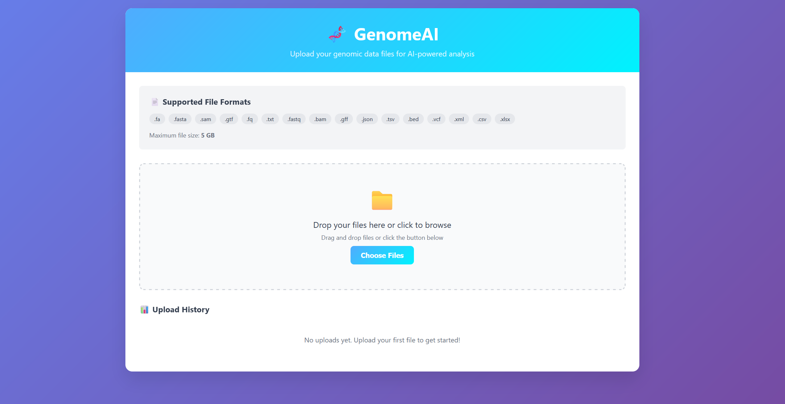

# Genome Craft Data Module Report 

For technical documentation - see **[Documentation_Data_Module.md](https://github.com/MilFey21/GenomeAI_data_module/blob/main/Documentation_Data_Module.md)**

## 1. Requirements Analysis and Task Definition

**Objectives:**
- Implement a secure, user-friendly file upload module for the Genome AI platform to support automatic model training on user data.
- Ensure support for common genetic data formats (CSV, TSV, XLSX, VCF, FASTA, etc.) and large file sizes (up to 5 GB).
- Integrate the module with Genome AI’s authentication and authorization system to ensure only authorized users can upload and access files.
- Provide robust validation, error handling, and feedback for users during the upload process.

**Deliverables:**
- Technical requirements document specifying supported file types, size limits, validation rules, and security measures.
- List of integration points with existing Genome AI backend and data storage systems.
- User stories and acceptance criteria for upload workflows.

---

## 2. Module Architecture Design

**System Components:**
- **Frontend Upload Interface:** Web form with drag-and-drop and progress indicators.
- **Backend API:** RESTful endpoints for file upload, validation, storage, and status reporting.
- **File Storage:** Integration with cloud storage (e.g., AWS S3, GCP Storage, or on-premises solution).
- **Validation Service:** Checks file format, size, integrity, and schema compliance.
- **Integration Layer:** Connects uploaded files to the automated model training pipeline.

**Data Flow:**
1. User selects or drags a file into the upload interface.
2. File is sent to the backend API, which performs validation.
3. On success, the file is stored, and metadata is registered in the database.
4. The training pipeline is triggered with the uploaded data reference.

**Deliverables:**
- Architecture diagram (UML or block diagram).
- API specification (OpenAPI/Swagger).
- Documentation of integration points and data flow.

---

## 3. Prototype Development of Upload Interface

**Tasks:**
- Design and implement a responsive web-based upload form with:
  - Drag-and-drop support.
  - File selection via dialog.
  - Real-time progress bar and status messages.
  - File type and size validation on the client side.
- Provide clear error messages for unsupported formats or failed uploads.
- Allow users to view upload history and status of each file.

**Deliverables:**
- Interactive UI prototype (Figma, HTML/CSS/JS, or React component).
- Screenshots and user flow diagrams.
- Usability testing results and feedback summary.

---

## 4. Backend Implementation of File Upload Logic

**Tasks:**
- Develop REST API endpoints:
  - `POST /api/upload` for file submission.
  - `GET /api/uploads` for listing user uploads.
  - `GET /api/upload/{id}/status` for upload status.
- Implement server-side validation:
  - File type/extension and MIME type checks.
  - Size and integrity validation.
  - Virus/malware scanning (optional).
- Integrate with cloud/on-premises storage for scalable file management.
- Ensure robust error handling and logging.
- Connect upload logic with Genome AI’s authentication and permissions system.

**Deliverables:**
- Source code with unit tests.
- API documentation.
- Integration test reports.

---

## 5. Integration with Automated Model Training Pipeline

**Tasks:**
- Register uploaded files in the Genome AI database with user and metadata linkage.
- Trigger model training jobs upon successful upload and validation.
- Implement status tracking (queued, processing, completed, failed) for each training job.
- Provide API/webhooks for monitoring job progress and results.
- Ensure secure and efficient data transfer between storage and training pipeline.

**Deliverables:**
- Integration scripts and configuration files.
- Status monitoring dashboard or API.
- End-to-end test cases demonstrating full workflow from upload to model training.


## 6. GenomeAI Data Module Features

### **Interface:**


### **Architecture scheme:**


### **Core Functionality:**
- **Modern Web Interface**: Beautiful, responsive design with gradient styling
- **Drag & Drop Upload**: Users can drag files directly onto the upload area
- **File Selection Dialog**: Click-to-browse functionality for traditional file selection
- **Real-time Progress Tracking**: Visual progress bar during file upload
- **Comprehensive Validation**: Client-side and server-side file validation

### **Supported File Formats:**
- **Genomic Data**: CSV, TSV, XLSX, VCF, FASTA, FASTQ
- **Bioinformatics**: BED, GFF, GTF, SAM, BAM
- **General**: TXT, JSON, XML
- **File Size**: Up to 5 GB per file

### **Error Handling & Logging:**
- **Comprehensive Logging**: All upload attempts logged with timestamps
- **Error Classification**: Specific error codes for different failure types
- **User-Friendly Messages**: Clear error messages for validation failures
- **Upload History**: Track all upload attempts with status indicators

### **Security Features:**
- **File Type Validation**: Extension and MIME type checking
- **Secure Filenames**: Automatic filename sanitization
- **Size Limits**: Enforced 5GB maximum file size
- **Session Management**: User isolation and authentication hooks

### **Files Created:**

1. **`genomeai_frontend.py`** - Main Flask application with:
   - File upload endpoints
   - Validation logic
   - Error handling
   - Upload history tracking
   - Logging system

2. **`templates/upload.html`** - Modern HTML interface with:
   - Drag-and-drop functionality
   - Progress indicators
   - Real-time validation
   - Upload history display
   - Responsive design

3. **`genomeai_backend.py`** - Backend processor with:
   - Advanced file validation
   - Format-specific content checking
   - ML pipeline integration hooks
   - Processing status tracking

4. **`run_genomeai.py`** - Easy startup script
5. **`requirements.txt`** - Dependencies list

### **How to Run:**

```bash
# Install dependencies
pip install -r requirements.txt

# Run the application
python run_genomeai.py
```

Then visit `http://localhost:5000` to access the upload interface.


